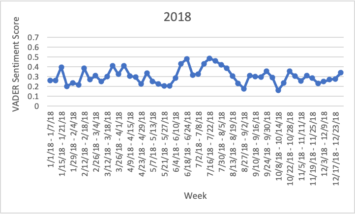

## Introduction / Background

Our team’s project will be centered around sentiment analysis on Reddit’s r/gatech community[^1]. We intend to analyze the change in sentiment on student wellbeing around critical events such as registration, withdrawal deadlines, final exams, etc. The r/gatech subreddit is an incredibly active forum and is composed of Georgia Tech students and alumni who share news, school logistics, and their opinions.

In general, U.S. Colleges struggle to provide adequate mental health services to their students. The COVID-19 pandemic has further impacted student’s mental health [^2]. Nearly 40% of all college students experience depression and the number of students seeking mental health services in 2021 has doubled from previous years[^3] [^4]. According to Mayo Clinic, of those students that are struggling at school almost 75% refused to seek help and may resort to vent their frustration via other outlets[^5].

Koustaf and Yousef examined college student posts on Reddit as a whole from 2011 to 2016[^6] and found significant social media activity by students to express frustrations correlated to the number of on-campus mental health consultations. With the limited on-campus interactions brought by the pandemic, Reddit has taken on heightened importance to student communication. We are interested in finding the correlation between mental health on Georgia Tech’s campus based on Reddit posts and the time during the semester.

## Problem Definition

Universities struggle to assess the mental health of their student bodies, especially when students are reluctant to seek help. The ongoing COVID pandemic has further isolated students by limiting in-person activity. This contributes to a decline in mental health. Social media is a platform for students to vent, and understanding the sentiment behind student posts can provide valuable insights into the well-being of the community.

## Data Collection

We used the Pushshift Multithread API Wrapper (PMAW) [^7]  to scrape the r/gatech subreddit and compile our dataset. Pushshift (pushift.io) is a regularly updated database of Reddit posts and comments. The database can be accessed via an exposed API that PMAW relies on. We retrieved 30,000 posts starting from 01/01/2018 through 12/31/2021. We marked posts from 01/01/2018 through 02/28/2020 as pre-COVID posts and posts from 03/01/2020 through 12/31/2021 as post-COVID posts. 

In the process of data cleaning, posts that do not have a body and duplicate posts were removed. This leaves a total post count of 18,502. Additionally, the text was lemmatized, resulting in a ‘bag of words’ . Below is an example post before and after lemmatization:

Before: They’re no longer my parents.
After: \['longer', 'parent'\]

In the case where we needed to train our model, we required a labeled dataset, preferably from a social media platform to be as similar as possible to our reddit data. We found the Sentiment 140 [^8] dataset to fit our needs, which consists of 1.6 million tweets labeled as positive or negative.

## Methods

### Vader

Our first approach utilizes supervised learning via VADER (Valence Aware Dictionary and Sentiment  Reasoner) [^9]. VADER is a sentiment analysis tool that utilizes comprehensive, high quality lexicon (about 7500 features), and sophisticated linguistic rules to produce sentiment scores. It is a rule-based model that will allow us to more accurately consider the sentiment of emojis, emoticons, and internet slang. VADER is an open-source resource and quite easy to use. When tested, VADER performed with 72% accuracy on a dataset containing social media-like text. A significant metric analyzed from VADER is the compound score which summarizes the sentiment intensity of the input text. The compound score is derived from positive, neutral, and negative scores. The compound score ranges from -1 to 1, where -1 indicates a highly negative text, 0 is neutral, and 1 is highly positive.

### Flair (Pretrained and Custom)

Flair is a NLP framework that supports various text embedding libraries, enabling highly tunable sentiment analysis models [^10]. Flair is optionally pre-trained on a dataset consisting of 50,000 IMDB reviews evenly split into a testing and training set. The reviews are labeled on a scale from 1 to 10, with reviews with less than or equal to 4 representing negative reviews, greater than or equal to 7 representing positive reviews, and neutral otherwise. This dataset is customized with an ‘offensive language detection’ model, which places a higher weight on profanity, hate speech, and derogatory language when making its classification. When used to predict our Reddit dataset, it returned a binary classification of 0 (negative sentiment) or 1 (positive sentiment).

The text embedding package also supports custom-trained models. Consequently, we sampled 20,000 tweets from the Sentiment 140 dataset with an even split of positive and negative reviews to train our own sentiment analysis model. Each tweet was pre-processed through a stacked forward and backward embedding. The embedding for each tweet was calculated by taking the mean of each embedded word in the tweet. The dataset was trained on a binary classification model using the embeds as inputs. When predicting the classification for the Reddit dataset, we ran each post through the same embedding process and predicted the classification on the embeddings, with ‘0’ representing negative sentiment and ‘1’ representing positive sentiment.

The following discussion explores the performance of sentiment analysis using VADER’s rule-based model, Flair’s pre-trained text-embedding model, and our own Flair model on the r/gatech subreddit. 

## Results and Discussion

### Vader

Running VADER on the cleaned data yielded sentiment scores between -1 and 1 for each Reddit post from January 2018 till November 2021, with -1 indicating negative sentiment and 1 indicating positive sentiment. This encompassed social media posts from both before and after the onset of the COVID pandemic, with March 1, 2020 designated as the cutoff. A preliminary analysis of these sentiment scores found the pre-COVID sentiment average to be 0.3209 and the pre-COVID standard deviation among sentiment scores to be 0.5172. In comparison, the post-COVID average was slightly higher at 0.3495, and the post-COVID standard deviation was 0.5338. The histograms below provide a rough idea of the data distribution.

<table><tr>
<td>  </td>
<td>  </td>
</tr></table>

From these histograms, we can see that the data is left-skewed, meaning that in general we see more positive posts than negative posts for both pre-COVID and post-COVID datasets. An anomalous number of posts were in the neutral compound sentiment bin, indicating that the VADER model with the data-encoding outlined prior tended to over-classify posts as neutral. This will need to be accounted for during statistical testing.

It is important to note that the two separate datasets (pre-COVID and post-COVID) were unequal in size and range, due to the nature of the reddit forum. As the major goal of this analysis is to investigate patterns in sentimen time-series, we chunked our datasets further in order to perform valid analyses.

<table><tr>
<td>  </td>
<td>  </td>
</tr>
<tr>
<td>  </td>
<td>  </td>
</tr>
</table>

The prior images show the weekly average unsmoothed VADER sentiment score, separated by the years 2018-2021. Preliminary visual analysis indicates peaks in average sentiment in the summer months, low sentiment when school starts, and peaks at the end of the year in the holiday season, however, there is no clear difference in sentiment during the COVID year (2020). We use the Pearson correlation coefficient as the first investigatory metric of our analysis. Although it considers only linear relationships, It is intuitive, easy to understand, and easy to interpret. We are primarily looking for a sign relationship with this method.

<table><tr>
<td>  </td>
<td>  </td>
</tr></table>

The former matrix comes from the time series shown earlier. The values are near zero and do not indicate a relationship between data (no significance testing was performed here). However, at this resolution, there is considerable noise in our data. Consequently, we recomputed the correlation coefficients for the time-series (the latter matrix) at the monthly timescale as a naive form of smoothing. While the magnitude is now higher, the sign relationship between these statistics is more of note. When compared against the 2020 dataset, all values were negative, providing the initial evidence that there is a negative sentiment change during the peak period of COVID-19.

Following this result, we move on to compare variances and means of sentiment across these four years using F-tests and Welch’s t-tests respectively. Since both these test statistics rely on time-independence, we only consider the periods of March-April during each of the 4 years. We use a significance level of 0.01 on all our tests. We assume normal distribution by CLT since N > 900 for all samples.

<table>
<tr><td>  </td>
<td>Average, Standard Deviation, and Variance of sentiment for posts from March to April, by year.</td>
</tr>
<tr><td>  </td>
<td>p-values of the F-Tests and t-Tests between 2019 and 2018, 2020, 2021</td>
</tr></table>

Two noticeable observations are that the average sentiment in March and April of 2020 was lower compared to the other years, suggesting overall more negative posts, and that variance among expressed sentiment in those months in 2020 was higher than other years. To determine if the differences observed were significant, F-tests and t-tests were performed between a control year and the rest. 2019 was selected as the control year, due to it being the last year before the pandemic, and allowing us to compare 2019 to both a year immediately before it (pre-COVID) and years immediately after it (post-COVID). The F-Test was performed on the data to determine if the variance between any pair of two years was significantly different, and a t-Test was performed to determine if the average sentiment between any two years was significantly different. Both tests were performed with a significance level of 0.01. The results are displayed below.

The F-test indicated (with alpha 0.01) that the sample variance of sentiment in 2019 was only significantly different than that of 2020. An interpretation of this may be that the uncertainty of the impending lockdown caused an increase in volatility of sentiment.

Since we can no longer assume equal variance for all groups, we use Welch’s t-test instead of the traditional Student’s t-test; it performs similarly for our use case. The two-sided t-test indicated (with alpha 0.01) that the sample mean of sentiment in 2019 was only significantly different than that of 2020. Consequently, VADER shows that there is general decrease of happiness in the community as a result of the immediate lockdown, but returns to normal in the year following (around the time of the vaccine release but before the lifting of lockdown restrictions).

### Flair (Pretrained)

The Flair text-embedding model is fundamentally different from VADER’s rule-based approach, so it follows that its outputs will also contain key differences. Flair classifies sentiment discretely and binarily, which resulted in the elimination of the granular ‘neutral’ classification of our earlier approach. Therefore, it was not immediately clear whether this model had bias towards a certain classification. The output was modified such that negative classification held a value of ‘-1’ and positive classifications held a value of ‘1’. Naturally, this means that any given classification is more polarized than vanilla VADER, which will be accounted for later. A summary of our findings is shown below:

Both time periods of the subreddit dataset, as a whole, have negative mean sentiment. This is in stark contrast with VADER, which consistently clustered mean sentiment around 0.3 (positive). This difference may be due to the absence of neutral classification when taking the mean. From first-hand research, there are a variety of posts which claim that the r/gatech subreddit is an echo chamber for complaints, which seems to be preliminary supported by Flair, giving merit to text-embedding as a sentiment analysis tool. However, significant further evidence is needed to explore the validity of any conclusions. In order to do so, we undergo a similar significance analysis on this method as was done on VADER.

The correlation matrix generated using VADER at this time scale showed negative correlation exclusively against the ‘COVID Year’ 2020. With Flair, this relationship is not exhibited. In fact, correlation across years seems random and generally weak. This result may be attributed to changes in noise as a result of the binary classification, affecting the precision of the Flair model. It is expected that limited information will be extractable from a time series analysis of the data. Nonetheless, these plots are provided for the sake of completeness. Additionally, this demonstrates that correlation coefficients alone are not sufficient in demonstrating changes in outlook predicated by sentiment analysis models. 

The prior images show the weekly average unsmoothed Flair sentiment score, separated by the years 2018-2021. Visual analysis does not indicate any clear inter- or intra-year trends in sentiment. In both 2018 and 2021, the peak sentiments are found in the summer months, but are only distinguished by a small margin and are still negative overall. This trend is not clearly reflected in the years of 2019 and 2020. The range of this data across all years is wider than that of VADER, with Flair’s mean range [-0.1, -0.65] and VADER’s was [-0.2, -0.5]. As implied by the analysis of the correlation coefficients, this is a factor of noise and highly polar tagging. Interestingly, the year 2020 appears to be slightly convex - this effect is more clear when the trend lines are overlapped:

While these curves make the lack of correlation in this model apparent, sentiment for the year 2020, shown in red, generally bounds the other curves from below at the mean monthly timescale. This effect is most clear during the immediate lockdown periods of March through May, which is where the analysis of variance and mean are conducted. The results were as follows:

The choice of control for the statistical testing follows the same logic as the VADER analysis. It should be noted that since n > 900 for all 4 testing periods, the effect of a discrete versus continuous range is dampened when taking the mean. The results corroborate (to an even greater extent) the results of the testing on VADER - “The one-sided t-test indicated (with alpha 0.05) that the sample mean of sentiment in 2019 was only significantly different than that of 2020” and “The F-test indicated (with alpha 0.05) that the sample variance of sentiment in 2019 is not significantly different than any year.” However, it is significantly lower than the years 2018 and 2021. We are now approaching concrete evidence that there is a measurable decrease in sentiment and increase in volatility of sentiment during 2020. It should be noted that even though the sentiment score exists in different ranges, the outcome of the statistical testing is similar. This demonstrates that it is the relative change in sentiment that matters more than the actual score value, which may be largely arbitrary. This is important to note for cross-model comparisons. 

The data summary on the right side of the figure is provided as a visual reference point for the statistical tests performed. Markedly, while differences of sentiment score between Flair and VADER have been discussed, there are also notable differences of variances between the two models as well. Across the board, variance of sentiment in flair is around 23% of VADER’s, despite the model having a larger range and lower correlation across the entire dataset. This may be due to the fact that binary classification performs better when the data itself is more clearly polarized. In the following analysis of Flair trained on a custom dataset, this effect is explored further.

### Flair (Custom-Trained)

The packaged Flair sentiment analysis model, as highlighted in the methods section, uses an IMDB database to train its embeds. We chose to train a custom Flair model on the Sentiment 140 tagged tweet dataset in an attempt to improve accuracy for sentiment classification specifically in social media contexts.  By analyzing the results from this custom-Flair model, we aim to discern whether the accuracy of sentiment classification improves when the model is trained on social-media text as opposed to movie reviews. One key sacrifice of using this model compared to the pre-trained classifier is the loss of “offensive language detection” tuning, which may increase the rate of false positives. Additionally, due to computational limitations, the model was only able to be trained on a corpus of 20,000 tweets, which may also negatively affect performance - pretrained Flair used over 50,000 reviews. This provides an opportunity to explore overfitting. 

A summary of the findings is provided below. Note that this table does not highlight pre-COVID/post-COVID eras and instead offers a holistic overview of the data across 2018-2021. Our analysis of VADER and pre-trained Flair did not yield immediate conclusions from directly comparing pre-COVID and post-COVID data, so this analysis was omitted for the custom flair model. However, this table does provide valuable insight into the differences between the three models. Like its embedding counterpart, it classifies posts to be generally negative, but compared to both models, it is far more polar in its classification. This is a surprising result since this model lacks ‘offensive language detection’, showing that the choice of the dataset is important when performing language tasks - context matters. The extent to which this polarity reflects the ground truth will need to be explored further. 

As with the previous two models, averaging the sentiment by week results in noisy data with no easily discernible patterns or trends. In contrast to VADER and in alignment with the pre-trained Flair model, average sentiment is consistently negative. Consequently, no conclusion can be drawn from correlation analysis and so the matrix is omitted. The result drawn from VADER with this method is also likely invalid. 

Changing the resolution to the monthly timescale results in a considerably less noisy graph compared to the earlier two methods. There are interesting patterns to note in the years of 2020 and 2021. There is a considerable dip in sentiment in the months of April and May of 2020, and generally stable otherwise. This is the period which immediately followed the outbreak of the pandemic. The dip suggests that the chaos of the outbreak and students being forced to go remote was received negatively by the subreddit. In 2021, we also see the graph trending upwards from the period of March to October, which is when a portion of the student body returned to campus (but stayed online). This peak sentiment is higher than the mean sentiment of the entire dataset - the forum was excited. 

Statistical testing on sentiment during the months of March and April for each year are reported above. In contrast with these results from the VADER and pre-trained Flair models, 2020 is not unique in being the year with a significantly lower mean and larger variance. In fact, with 2019 as the control group, all but one measure found each year to be similar by mean and variance. One possible explanation for this is that the custom-flair model is highly predisposed to classify posts as negative; even if 2020 did have more negative posts, this difference would be imperceptible if the model already classified a majority of posts as negative. Regardless, this result is surprising given the trends shown in the monthly-scale time-series. 

The aggregate chart of sentiment of the three models is provided below for your reference. We’ve also added the VADER (binary) rating which is a custom heuristic generated to discretize the rating system of the model. It works as follows: {-1 : score < -0.05, 0 : score < \|0.05\|, 1: score > 0.05}. It polarizes the data upwards slightly, but the differences in trend are similar due to the large dataset when taking a mean. Consequently, this gives validity to a direct comparison of VADER against Flair for large samples using time series. We apply this logic for measuring accuracy, shown in the next section. 

### Error

To gauge the error of the three models, we required labeled data to compare the results with. Instead of using a tagged social media dataset from online, we opted to tag our own data for a more conclusive analysis. We were able to manually tag 350 posts from the Georgia Tech subreddit, sampled from the month of March of each year (2018-2021). Each of these tagged posts was independently rated as positive, negative, or neutral (1, -1, 0) by at least two team members, and differing ratings were discussed by the team until a conclusion was reached or a new post was selected to review instead. The month of March was chosen as it had been a significant focus for much of our analysis and had the largest variance across all three models.

A preliminary hurdle to overcome was that each model’s results were in a different form. VADER produced a value ranging from -1 to 1, allowing for posts to be tagged as neutral or “slightly polar” while Flair produced a binary output - strictly negative or positive. Our tagged data on the other hand held values of -1, 0, or 1. To estimate the MSE of the models, we averaged the sentiment of the posts for each day we had tagged data for, yielding a decimal score between -1 and 1 for each model and our tagged data that represented the average sentiment of the reddit posts for a particular day. With our results in a similar format, we were able to compare the values of each model against our tagged value to calculate the performance. The results are summarized below. All models performed similarly with reference to error, but shockingly, the custom Flair model had the lowest MSE. Overfitting is a possible cause for this result.

## Reflection, Issues, and Future Direction

Large amounts of noise within the data made it difficult to discover patterns across years as a whole. Analyzing distinct segments of time yielded more promising results. The months of March and April showed a significant differences in sentiment during 2020. We believe further research is needed to support these conclusions because this analysis is done in noisy conditions. An investigation of sentiment across the entire time-series is needed, perhaps using methods such as ARIMA. 

VADER is easy to implement, but the validaty of the output is difficult to compute. VADER does not recognize sarcasm or irony and does not consider the context in which words are used beyond basic cases, such as negation. Our results from running VADER suffer from this weakness because of the highly cynical and 'slangy' language of college students. The VADER model is provided with a pre-trained dataset of lexical features. The pre-trained nature is an advantage because it is trained on a reliable dataset (manual tagging using Amazon Mechanical Turk) that we would not be able to replicate with our time and financial resources. Nonetheless, the disadvantage with it already being trained is we are unable to tune the model to Reddit posts specifically.  For our existing analysis, we applied statistical tests without appropriately filtering anomalous data. As shown in the histograms in our results section, the VADER model overclassifies inputs as neutral. To smooth the curve, we can remove these neutral values and consider the temporal patterns without them. 

Similar to VADER, Flair was open-sourced and easy to implement. Flair was trained on the IMDB dataset and used an ‘offensive language detection’ model, which is more likely to rate posts with offensive language or curse words as negative. Given how different the general content of r/gatech and IMDB posts are, the pre-trained model was not tailored to Reddit posts. In general, given the college student demographic, it can be assumed that the Reddit posts contain more vulgar language, even in positive posts, compared to IMDB reviews. Therefore, it is understandable why the pre-trained Flair model dominantly predicts r/gatech posts as negative sentiment. Perhaps if the pre-trained model was not tuned to weight vulgar language differently, we would have seen more accurate results.

Our custom Flair model had similar issues to the pre-trained model. The training set was not the same as the Reddit content because tweets have a character limit and Reddit posts do not. In our Reddit dataset, there are numerous posts that tend to be very long, which is not represented in the Twitter training dataset. Furthermore, unlike VADER our Flair models do not use neutral values but instead are categorized positive (1) or negative (0). This could be a reason why our Sentiment140-trained Flair model tagged a majority of the posts as negative. There were also numerous embeddings that could have been used and stacked.

For the custom-trained Flair model, we chose the basic English forward and backward embeddings, but perhaps we could have used more representative embeddings that would have helped in understanding the context of the post. In general, having a bigger and more representative dataset would have also given more accurate predictions. A large dataset of labeled Reddit posts would be the best training and validation set. We did tag about 350 Reddit posts to compare to calculate MSE per model, but more accurate tagging and a larger set of tagged data could be used to train the custom Flair model as well.

## Conclusion 

Well, there’s a lot to consider! Let’s revisit our original objective: measuring changes in mental health due to COVID by considering changes in sentiment on the Georgia Tech subreddit. We considered three models for sentiment analysis: VADER, pre-trained Flair, and custom Flair with varying success. As a whole, we found a negligible difference between mean sentiment for th pre-COVID and post-COVID periods, although the three models scored them differently. Separating the data out further at an annual time-scale revealed the biggest issue with our strategy: noise. Despite this, we were able to discern drops in mean sentiment using the Flair models during the immediate lockdown period (March 2020 - May 2020) and a period of recovery in the year of 2021. F and T testing on this period across the four years showed that there was a significant decrease in mean sentiment and increase in variance, which we attribute to chaos, confusions, and stressors in the immediate lockdown period. All models had a similar error against manually tagged data, with the custom trained Flair model being the marginal top performer. This demonstrates the importance of choice of dataset for natural language processing tasks. We also conclude that, despite being purpose-built for social media, rule-based models such as VADERs are poor performers for sentiment analysis tasks because they cannot reasonably keep up with the evolving and localized nature of language. Overclassification of neutrals, noise, and lack of sarcasm detection detract from the performance of the VADER model. 

<a href="./assets/Combined Table and Error.xlsx" download>Download Our Raw Data</a>

## References

[^1]: Melton, C. A., Olusanya, O. A., Ammar, N., & Shaban-Nejad, A. (2021). Public sentiment analysis and topic modeling regarding COVID-19 vaccines on the Reddit social media platform: A call to action for strengthening vaccine confidence. Journal of Infection and Public Health, 14(10), 1505-1512.
[^2]: Saha, K., Yousuf, A., Boyd, R. L., Pennebaker, J. W., & De Choudhury, M. (2022). Social Media Discussions Predict Mental Health Consultations on College Campuses. Scientific Reports, 12(1), 1-11. From [link](https://www.nature.com/articles/s41598-021-03423-4).
[^3]: Aslanian, S., & Roth, A. (2021, August 19). Inside the College Mental Health Crisis. Inside the college mental health crisis \| Under Pressure \| APM Reports. Retrieved February 22, 2022. From [link](https://www.apmreports.org/episode/2021/08/19/under-pressure-the-college-mental-health-crisis).
[^4]: Sentiment Analysis & Machine Learning. MonkeyLearn Blog. (2020, April 20). Retrieved February 22, 2022. From [link](https://monkeylearn.com/blog/sentiment-analysis-machine-learning/).
[^5]: College students and Depression. Mayo Clinic Health System. (n.d.). Retrieved February 22, 2022. From [link](https://www.mayoclinichealthsystem.org/hometown-health/speaking-of-health/college-students-and-depression).
[^6]: Son, C., Hegde, S., Smith, A., Wang, X., & Sasangohar, F. (2020). Effects of COVID-19 on College Students' Mental Health in the United States: Interview Survey Study. Journal of medical Internet research, 22(9), e21279. From [link](https://doi.org/10.2196/21279).
[^7]: Mattpodolak. (2019, October 1). Mattpodolak/PMAW: A multithread pushshift.io Api wrapper for reddit.com comment and submission searches. GitHub. Retrieved April 26, 2022, from [link](https://github.com/mattpodolak/pmaw).
[^8]: Go, A., Bhayani, R. and Huang, L., 2009. Twitter sentiment classification using distant supervision. CS224N Project Report, Stanford, 1(2009), p.12.
[^9]: ​​Hutto, C.J. & Gilbert, E.E. (2014). VADER: A Parsimonious Rule-based Model for Sentiment Analysis of Social Media Text. Eighth International Conference on Weblogs and Social Media (ICWSM-14). Ann Arbor, MI, June 2014.
[^10]: Alan Akbik, Duncan Blythe, and Roland Vollgraf. 2018. Contextual String Embeddings for Sequence Labeling. In Proceedings of the 27th International Conference on Computational Linguistics, pages 1638–1649, Santa Fe, New Mexico, USA. Association for Computational Linguistics.
